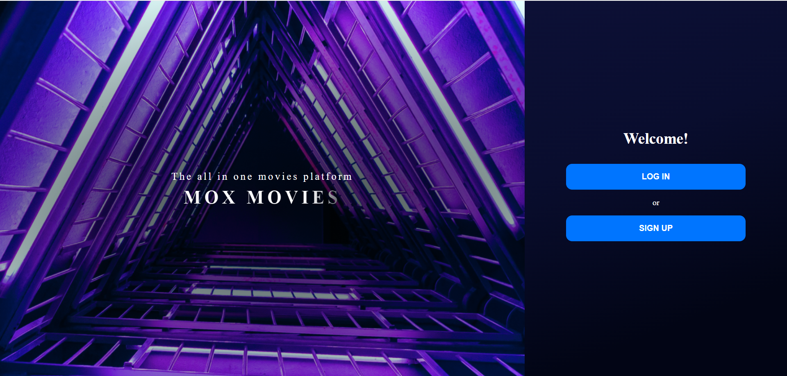
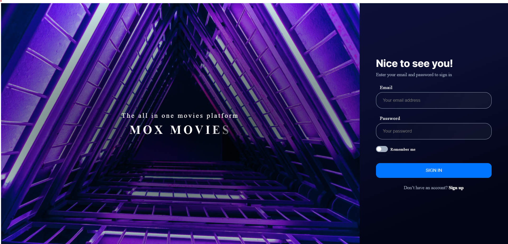
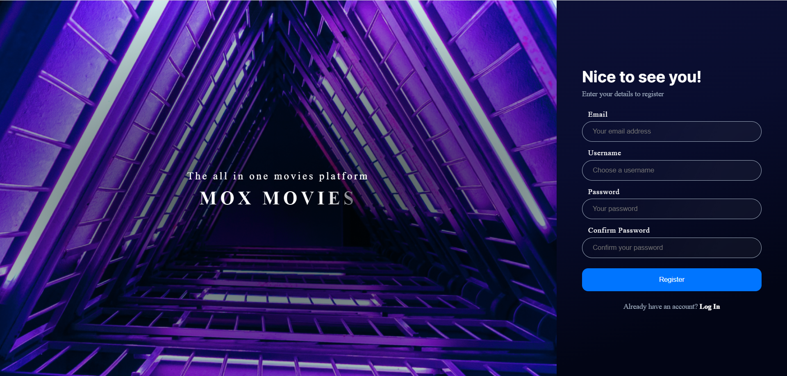
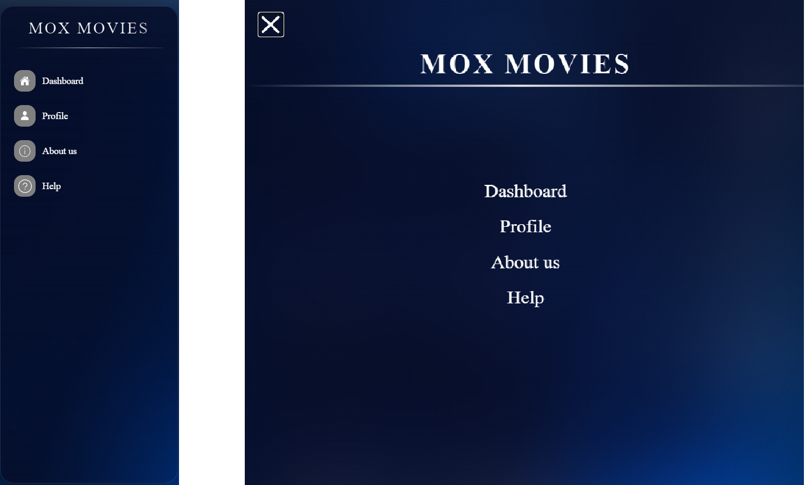
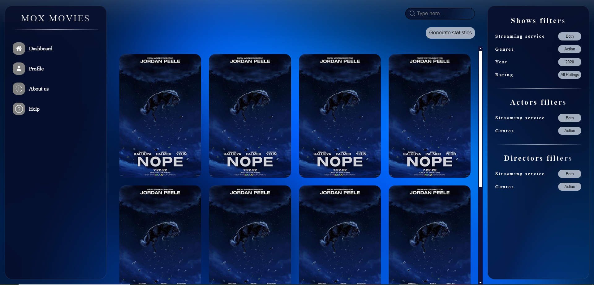
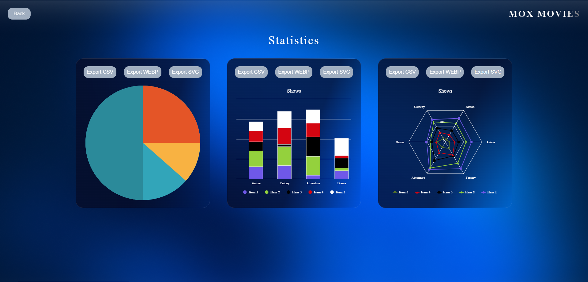
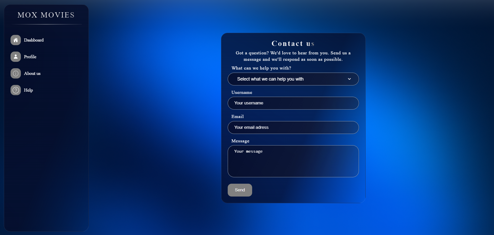
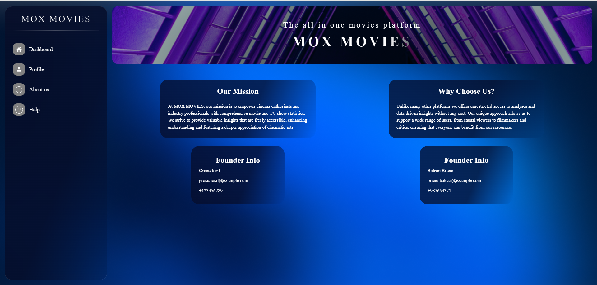
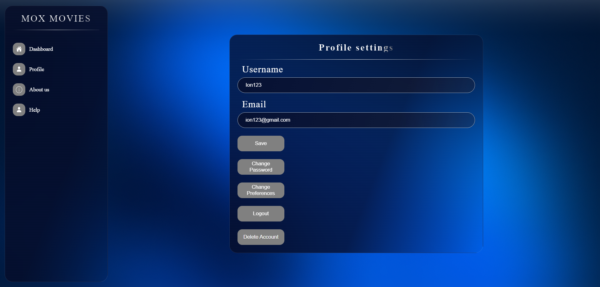

<!DOCTYPE html>
<html lang="ro">
<head>
        <!-- <title>Documentația MoX</title> -->
        <meta charset="UTF-8">
</head>
<body>
<article>
    <header>
        <h1>
            MoX (Movies and TV Shows Explorer)
        </h1>
    </header>
    <h2>DEMO video:</h2>
    <a href="https://youtu.be/wL139K2g05M">https://youtu.be/wL139K2g05M</a>
    <h3>Note: C4 diagrams are in "docs\C4 diagrams"</h3>
    <h2>Cuprins</h2>
    <ul>
        <li>
            <a href="#authors">Autori</a>
        </li>
        <li>
            <a href="#introduction">1. Introducere</a>
            <ul>
                <li><a href="#introduction-purpose">1.1 Scop</a></li>
                <li><a href="#conventions">1.2 Convenție de scriere</a></li>
                <li><a href="#audience">1.3 Publicul țintă</a></li>
                <li><a href="#product-scope">1.4 Scopul produsului</a></li>
                <li><a href="#references">1.5 Referințe</a></li>
            </ul>
        </li>
        <li><a href="#overall">2. Descriere Generală</a>
            <ul>
                <li><a href="#product-perspective">2.1 Perspectiva produsului</a></li>
                <li><a href="#product-functions">2.2 Funcțiile produsului</a></li>
                <li><a href="#users">2.3 Clase și caracteristici ale utilizatorilor</a></li>
                <li><a href="#operating-environment">2.4 Mediul de operare</a></li>
                <li><a href="#documentation">2.5 Documentația pentru utilizator</a></li>
            </ul>
        </li>
        <li><a href="#external">3. Interfețele aplicației </a>
            <ul>
                <li><a href="#user-interface">3.1 Interfața utilizatorului </a>
                    <ul>
                        <li><a href="#landing-page">3.1.1 Prima pagină</a></li>
                        <li><a href="#login-page">3.1.2 Pagina de autentificare </a></li>
                        <li><a href="#signup-page">3.1.3 Pagina de înregistrare </a></li>
                        <li><a href="#menu">3.1.4 Meniul de navigație </a></li>
                        <li><a href="#dash-board">3.1.5 Pagina de acasă </a></li>
                        <li><a href="#statistics">3.1.6 Statistici pentru filme </a></li>
                        <li><a href="#help">3.1.7 Ajutor</a></li>
                        <li><a href="#about">3.1.8 Despre Noi</a></li>
                    </ul>
                </li>
                <li><a href="#hardware-interface">3.2 Interfața Hardware </a></li>
                <li><a href="#software-interface">3.3 Interfața Software</a></li>
                <li><a href="#communication-interface">3.4 Interfața de comunicare</a></li>
            </ul>
        </li>
        <li><a href="#system-features">4. Caracteristici ale sistemului</a>
            <ul>
                <li><a href="#first-feature">4.1 Recomandari</a>
                    <ul>
                        <li><a href="#first-feature-1">4.1.1 Descriere si Prioritate</a></li>
                        <li><a href="#first-feature-2">4.1.2 Stimul/Raspuns</a></li>
                        <li><a href="#first-feature-3">4.1.3 Cerinte Functionale</a></li>
                    </ul>
                </li>
                <li><a href="#second-feature">4.2 View Profile</a>
                    <ul>
                        <li><a href="#second-feature-1">4.2.1 Descriere si Prioritate</a></li>
                        <li><a href="#second-feature-2">4.2.2 Stimul/Raspuns</a></li>
                        <li><a href="#second-feature-3">4.2.3 Cerinte Functionale</a></li>
                    </ul>
                </li>
                <li><a href="#third-feature">4.3 Statistici & Export</a>
                    <ul>
                        <li><a href="#third-feature-1">4.3.1 Descriere si Prioritate</a></li>
                        <li><a href="#third-feature-2">4.3.2 Stimul/Raspuns</a></li>
                        <li><a href="#third-feature-3">4.3.3 Cerinte Functionale</a></li>
                    </ul>
                </li>
                <li><a href="#fourth-feature">4.4 Ajutor pentru user</a>
                    <ul>
                        <li><a href="#fourth-feature-1">4.4.1 Descriere si  Prioritate</a></li>
                        <li><a href="#fourth-feature-2">4.4.2 Stimul/Raspuns</a></li>
                        <li><a href="#fourth-feature-3">4.4.3 Cerinte Functionale</a></li>
                    </ul>
                </li>
            </ul>
        </li>
        <li><a href="#non-functional">5.Funcționalități pentru protecție și securitate</a>
            <ul>
                <li><a href="#safety">5.1 Protecția datelor</a></li>
                <li><a href="#security">5.2 Securizarea datelor</a></li>
                <li><a href="#software-attributes">5.3 Calitățile Software </a></li>
            </ul>
        </li>
    </ul>
    

        <section id="authors" typeof="sa:AuthorsList">
            <h2>Autori</h2>
            <ul>
                <li property="schema:author" typeof="sa:ContributorRole">
            
              <meta content="Bruno" property="schema:givenName">
              <meta content="Cristian" property="schema:additionalName">
              <meta content="Balcan" property="schema:familyName">
              Balcan Bruno-Cristian
            
                    <ul>
                        <li property="schema:roleContactPoint" typeof="schema:ContactPoint">
                            <a href="mailto:bruno.balcan@gmail.com" property="schema:email">bruno.balcan@gmail.com</a>
                        </li>
                    </ul>
                </li>
                <li property="schema:author" typeof="sa:ContributorRole">
            
              <meta content="Iosif" property="schema:givenName">
              <meta content="Grosu" property="schema:familyName">
              Grosu Iosif
            
                    <ul>
                        <li property="schema:roleContactPoint" typeof="schema:ContactPoint">
                            <a href="mailto:grosuiosif2@gmail.com" property="schema:email">grosuiosif2@gmail.com</a>
                        </li>
                    </ul>
            </ul>
        </section>
    

    <section id="introduction">
        <h3>1. Introducere</h3>
        <section id="introduction-purpose">
            <h4>1.1 Scop</h4>
            

                MoX (Movies and TV Shows Explorer) este o aplicație web dezvoltată sub formă de proiect în cadrul materiei Tehnologii Web de la
                Faculteatea de Informatică a Universității Alexandru Ioan Cuza, Iași. Scopul acestui document este de a prezenta o descriere
                detaliată a funcționalităților, precum și de a specifica cerințele aplicației web. Aplicația va oferi utilizatorilor detalii despre
                filme și seriale, asemenea serviciilor de streaming precum Netflix sau Disney. De asemenea, utilizatorii pot consulta diverse chart-uri
                ce oferă statistici despre popularitate, bilete vândute, etc.
            

        </section>
        <section id="conventions">
            <h4> 1.2 Convenția documentului</h4>
            <ul>
                <li>
                    Acest document urmează șablonul de documentație a cerințelor software conform IEEE Software
                    Requirements
                    Specification.
                </li>
                <li>
                    Textul <b>îngroșat</b> este folosit pentru a defini noțiuni personalizate sau pentru a accentua
                    concepte
                    importante.
                </li>
            </ul>
        </section>
        <section id="audience">
            <h4>1.3 Publicul țintă</h4>
            

                Acest document este destinat profesorilor, studenților sau dezvoltatorilor, însă orice utilizator poate consulta
                secțiunile de <b>Interfața utilizatorului</b> și <b>Caracteristici ale sistemului</b>
                pentru a obține o mai bună înțelegere a ceea ce oferă aplicația.
            

        </section>
        <section id="product-scope">
            <h4>1.4 Scopul Produsului</h4>
            

                Scopul aplicației este de a oferi utilizatorilor o platformă sub forma unei baze de date pentru filme și seriale. 
                Cei care folosesc aplicația pot descoperi cele mai noi filme alături de detalii despre acestea precum distribuția, rating-ul, premiile, etc. 
                Utilizatorii vor putea căuta folosind opțiunea de 'search' filmul sau serialul TV despre care doresc să se informeze. 
                De asemenea, aceștia vor putea filtra filmele de pe pagina principală după categorie: acțiune, animație, comedie, horror, etc. Pentru a oferi o mai bună experiență pentru utilizatori, aceștia
                își vor putea crea un cont în aplicație pentru a putea beneficia de rezultate relevante propriilor preferințe.
            

        </section>
        <section id="references">
            <h4>1.5 Bibliografie</h4>
            <ul>
                <li>Cursul Tehnologii Web din cadrul facultatii</li>
                <li>
                    <a href="https://github.com/rick4470/IEEE-SRS-Tempate">H Rick. IEEE-Template - GitHub</a>
                </li>
            </ul>
        </section>
    </section>
    <section id="overall">
        <h3>2. Descriere Generală</h3>
        <section id="product-perspective">
            <h4>2.1 Perspectiva produsului</h4>
            

                Mox (Movies and TV Shows Explorer) este o un proiect realizat în cadrul cursului Tehnologii Web, 
                al cărui scop este să ofere utilizatorilor detalii despre 
                filmele și serialele TV disponibile pe serviciile de streaming.
            

        </section>
        <section id="product-functions">
            <h4>2.2 Funcționalitățile produsului</h4>
            Fiecare utilizator va avea acces la urmatoarele funcționălități:
            <ul>
                <li>să se înregistreze pe site.</li>
                <li>să se autentifice pe site.</li>
                <li>să își reseteze parola în cazul în care a uitat-o.</li>
                <li>să exploreze pagina "Dashboard"</li>
                <li>opțiunea de a căuta filme și seriale după nume</li>
                <li>opțiunea de a filtra după categoria de film</li>
                <li>să vizualizeze statisticile pentru filme/seriale TV</li>
                <li>să exporte statisticile (3 opțiuni de format: CSV, WebP, SVG)</li>
                <li>să acceseze pagina "Despre" pentru a accesa scurtă descriere a paginii web</li>
                <li>să acceseze pagina "Ajutor" pentru a beneficia de sfaturi în vederea utilizării aplicației</li>
            </ul>
        </section>
        <section id="users">
            <h4>2.3 Clase și caracteristici ale utilizatorilor</h4>
            <ul>
                <li>Utilizatorii <b>neautentificați</b> trebuie sa se inregistreze pentru a-si face un cont.
                <li>
                    Utilizatorii <b>autentificați</b> au acces la:
                    <ul>
                        <li>
                            home-page-ul general, necustomizat în privința preferințelor;
                        </li>
                        <li>
                            abilitatea de a căuta filme și seriale TV, cât și de a filtra rezultatele primite;
                        </li>
                        <li>
                            detalii și statistici despre filmul sau serialul TV căutat;
                        </li>
                    </ul>
                </li>
            </ul>
        </section>
        <section id="operating-environment">
            <h4>2.4 Mediul de operare</h4>
            

                Produsul dezvoltat poate fi utilizat pe orice dispozitiv cu un browser web care suportă HTML5, CSS și
                JavaScript.
            

        </section>
        <section id="documentation">
            <h4>2.5 Documentația pentru utilizator</h4>
            

                Acest document vine în sprijinul utilizatorilor oferind detalii despre funcționalităților aplicației web.
            

        </section>
    </section>
    <section id="external">
        <h3>3. Interfețele aplicației</h3>
        <section id="user-interface">
            <h4>3.1 Interfața utilizatorului</h4>
            Mai jos, puteți vedea o prezentare generală a fiecărei pagini a aplicației și funcționalităților pe care le
            oferă:
            <ul>
                <li id="landing-page"><b>Prima pagină</b>
                    <ul>
                        <li>Aceasta reprezintă prima pagină pe care o vede utilizatorul când intră pe site.</li>
                        <li class="pictures" style="list-style: none"></li>
                    </ul>
                </li>
                <li id="login-page"><b>Pagina de autentificare</b>
                    <ul>
                        <li>Pagina are rolul de a realiza autentificarea utilizatorilor la MoX.</li>
                        <li class="pictures" style="list-style: none"></li>
                    </ul>
                </li>
                <li id="signup-page"><b>Pagina de înregistrare</b>
                    <ul>
                        <li>În cazul în care utilizatorul nu are un cont pe platforma MoX, acesta se poate înregistra folosind această pagină.</li>
                        <li class="pictures" style="list-style: none"></li>
                    </ul>
                </li>
                <li id="menu"><b>Meniul de navigație</b>
                    <ul>
                        <li>Aceasta reprezintă meniul de navigare către fiecare pagină a aplicației, prezent pe fiecare pagină.</li>
                        <li class="pictures" style="list-style: none"></li>
                    </ul>
                </li>
                <li id="dash-board"><b>Pagina de acasă</b>
                    <ul>
                        <li>Aici puteți căuta filme sau seriale, să filtrați rezultatele, să generați statistici sau să săriți la altă pagină.</li>
                        <li class="pictures" style="list-style: none"></li>
                    </ul>
                </li>
                <li id="statistics"><b>Statistici pentru filme</b>
                    <ul>
                        <li>Aici puteți urmări statisticile filmului sau serialului ales.</li>
                        <li class="pictures" style="list-style: none"></li>
                    </ul>
                </li>
                <li id="help"><b>Ajutor</b>
                    <ul>
                        <li>Aici ne puteți pune întrebări în cazul în care aveți nevoie de ajutor.</li> 
                        <li class="pictures" style="list-style: none"></li>
                    </ul>
                </li>
                <li id="about"><b>Despre noi</b>
                    <ul>
                        <li>
                            Aici puteti afla mai multe despre noi, cine suntem si scopul paginii.
                        </li>
                        <li class="pictures" style="list-style: none"></li>
                    </ul>
                </li>
                <li id="profile"><b>Pagina de profil</b>
                    <ul>
                        <li>Aici puteti sa va schimbati detaliile profilului precum username-ul, parola, etc.</li> 
                        <li class="pictures" style="list-style: none"></li>
                    </ul>
                </li>
            </ul>
            <section id="hardware-interface">
                <h4>3.2 Interfața Hardware</h4>
                

                    Acest produs nu necesită interfețe hardware, funcționând pe browser-ul oricarui device 
                    (calculatoare, laptopuri, telefoane etc.).
                

            </section>
            <section id="software-interface">
                <h4>3.3 Interfața Software</h4>
                

                    Cerințele minime de software includ un browser funcțional, compatibil cu HTML5 și cu JavaScript.
                <h5>MongoDB</h5>
                Este o baza de date NoSQL în care stocăm informații despre fiecare utilizator: email, username, parola(aceasta va fi criptata pentru a proteja 
                informatiile utilizatorului) si trei preferințe ale utilizatorului. 
                Filmele si serialele TV vor fi de asemenea stocate in baza de date dupa urmatorul format didctat de fisierul CSV primit.
                

                    Exemplu:
                

                

                    {
                         
                        &emsp;"_id": {
                             
                                &emsp;&emsp;"$oid": "648eb70f28a5af0e1179eae6"
                             
                        &emsp;},
                         
                        &emsp;"type": "Movie",
                         
                        &emsp;"title": "Osuofia in London II",
                         
                        &emsp;"director": [
                        "Kingsley Ogoro"
                      ],
                         
                        &emsp;"actors": [
                        "Nkem Owoh",
                        "Mara Derwent",
                        "Francis Odega",
                        "Cynthia Okereke",
                        "Tom Njemanze",
                        "Romanus Amuta",
                        "Sabina Mole",
                        "Blessing Onolleka",
                        "Oluchi Agunwa",
                        "Chiwendu Onaga",
                        "Patricia Ezeani",
                        "Stephen Ahanonu"
                      ],
                        &emsp;"country": "",
                         
                        &emsp;"date_added": "June 22, 2021",
                         
                        &emsp;"release_year": 2004,
                         
                        &emsp;"rating": "TV-14",
                         
                        &emsp;"duration": 70,
                         
                        &emsp;"genres": [
                        "Comedies",
                        "Dramas",
                        "International Movies"
                      ],
                         
                        &emsp;"description": "After collecting his brother's inheritance, Osoufia returns to his Nigerian village with wealth and a British wife whose presence soon causes trouble.",
                         
                        &emsp;"streaming_platform": "Netflix"
                         
                    }
                

            </section>
            <section id="communication-interface">
                <h4>3.4 Interfața de comunicare</h4>
                

                    Aplicația necesită o conexiune la internet. Standardul de comunicare care va fi utilizat este HTTP.
                

            </section>
            <section id="system-features">
                <h3>4. Caracteristici ale sistemului</h3>
                <section id="first-feature"><h4>4.1 Recomandari</h4>
                    <h5 id="first-feature-1">4.1.1 Descriere si  Prioritate</h5> 
                    Cea mai imporatnta pagina este pagina de "dashboard". Pentru a accesa aceasta pagina, user-ul va trebui sa se autentifice.
                    Pe baza preferintelor alese, pagina va sugera o lista de filme si seriale TV pe care le va afisa cu imagine, titlu si data lansarii.
                    <h5 id="first-feature-2">4.1.2 Stimul/Raspuns</h5>
                    <ul>
                        <li>
                            Dupa sign-up, userul va fi redirectionat la pagina de preferinte unde isi va alege 3 genuri de filme.
                        </li>
                        <li>
                            Dupa sign-up sau sign-in, user-ul va ajunge la pagina Dashboard.
                        </li>
                        <li>
                            Din Dashboard, user-ul poate sa caute filmele si serialele folosind un search-bar sau folosindu-se de diferitele filtre ale apliatiei.
                            In plus acesta poate sa sorteze rezultatele dupa titlu sau scor.
                        </li>
                        <li>
                            Pe aceasta pagina se regaseste un meniu in care user-ul isi poate accesa profilul, pagina de "About us" sau pagina de "Help".
                        </li>
                        <li>
                            Tot de aici user-ul poate sa acceseze statisticile generate de lista de filme recomandata.
                        </li>
                    </ul>
                    <h5 id="first-feature-3">4.1.3 Cerinte Functionale</h5>
                    <ul>
                        <li>MoX trebuie sa salveze cele 3 preferinte ale utilizatorului</li>
                        <li>MoX nu permite unui utilizator sa acceseze dashboard-ul fara cele 3 preferinte</li>
                    </ul>
                </section>
                <section id="second-feature"><h4>4.2 View Profile </h4>
                    <h5 id="second-feature-1">4.2.1 Descriere si Prioritate</h5> 
                    Pagina de profil poate fi accesata din Dashboard. Este la fel de importanta precum sign-in sau sign-up deoarece userul isi poate schimba informatiile personale.
                    <h5 id="second-feature-2">4.2.2 Stimul/Raspuns</h5>
                    <ul>
                        <li>Aici user-ul isi poate schimba username-ul sau adresa de email</li>
                        <li>Daca doreste sa isi reseteza parola, acesta va fi redirectionat pe pagina "Reset Password"</li>
                        <li>De asemenea, user-ul isi poate schimba preferintele tot pe aceasta pagina</li>
                    </ul>
                    <h5 id="second-feature-3">4.2.3 Cerinte Functionale</h5>
                    <ul>
                        <li>MoX perimite userului sa se deconecteze de la aceasta pagina</li>
                        <li>User-ul isi poate vedea si schimba informatiile persoanale si preferintele</li>
                        <li>Pentru svhimbarea parolei, user-ul va primi un mail cu un link pentru o securitate mai buna</li>
                    </ul>
                </section>
                <section id="third-feature"><h4>4.3 Statistici & Export </h4>
                    <h5 id="third-feature-1">4.3.1 Descriere si Prioritate</h5> 
                    Aceasta pagina prezinta niste functionalitati importante ale aplicației. 
                    Astfel, imporatnta paginii poate fi comparata cu cea a Dashboard-ului sau a paginii de preferinte.
                    <h5 id="third-feature-2">4.3.2 Stimul/Raspuns</h5>
                    <ul>
                        <li>Din Dashboard, user-ul poate accesa aceasta pagina apasand butonul "Generate statistics"</li>
                        <li>Userul poate vizualiza 3 chart-uri cu statistici pe care le poate exporta in format CSV, SVG sau WebP</li>
                    </ul>
                    <h5 id="third-feature-3">4.3.3 Cerinte Functionale</h5>
                    <ul>
                        <li>Statisticile vor fi generate pe baza filmelor prezente in Dashboard</li>
                        <li>Statisticile nu vor putea fi generate daca nu au fost gasite rezultate pe pagina de Dashboard</li>
                    </ul>
                </section>
                <section id="fourth-feature"><h4>4.4 Ajutor pentru user</h4>
                    <h5 id="fourth-feature-1">4.4.1 Descriere si Prioritate</h5> 
                    Aceasta pagina nu are o importanta majora in ceea ce priveste functionalitatile principale ale aplicatiei.
                    Cu toate acestea, este necesara pentru a oferi un user experience mai bun si de a ajuta cu diversele probleme.
                    <h5 id="fourth-feature-2">4.4.2 Stimul/Raspuns</h5>
                    <ul>
                        <li>Din Dashboard, user-ul poate accesa pagina de "Help".</li>
                    </ul>
                    <h5 id="fourth-feature-3">4.4.3 Cerinte Functionale</h5>
                    <ul>
                        <li>Userul trebuie sa selecteze categoria problemei cu care se confrunta pentru a putea fi ajutat mai usor.</li>
                        <li>Userul trebuie sa mai introduca username-ul, adrasa de email si un mesaj care va fi trimis prin email la un membru al echipei MoX.</li>
                    </ul>
                </section>
            </section>
            <section id="non-functional">
                <h3>5. Funcționalități pentru protecție și securitate</h3>
                <section id="safety">
                    <h4>5.1 Protecția datelor</h4>
                    

                        MoX implementează măsuri stricte de protecție a datelor pentru a preveni accesul neautorizat și pierderea datelor utilizatorilor. Parolele utilizatorilor sunt criptate împreună cu toate datele personale sunt salvate și stocate în siguranță într-o baza de date proprie.
                    

                </section>
                <section id="security">
                    <h4>5.2 Securizarea datelor</h4>
                    

                        Conturile utilizatorilor sunt protejate de un sistem de autentificare care folosește criptarea bcrypt a parolelor și token-uri de acces pentru a menține confidențialitatea și securitatea datelor lor.
                Alte măsuri de securitate luate includ: prevenirea atacurilor de tip SQL-injection și blocarea cererilor consecutive multiple venite de la un utilizator pentru a preveni încetinirea aplicației.
                    

                </section>
                <section id="software-attributes">
                    <h4>5.3 Calitățile Software</h4>
                    <ul>
                        <li>Adaptabilitate</li>
                        <li>Ușurință în utilizare</li>
                        <li>Flexibilitate</li>
                    </ul>
                </section>
            </section>
        </section>
    </section>
</article>
</body>
</html>
